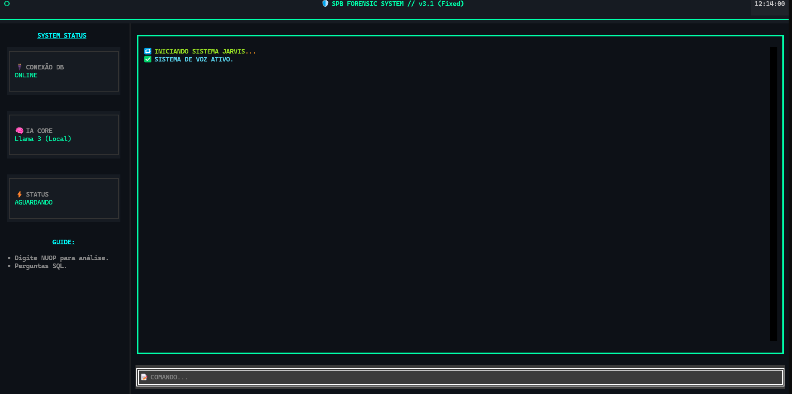

# 🛡️ Jarvis SPB: Agente Forense Bancário (v3.1)

> **Sistema Autônomo de Observabilidade e Forense Bancária** capaz de diagnosticar falhas em transações (PIX/SPB), calcular SLA em tempo real e converter linguagem natural em SQL complexo.

*(Interface TUI desenvolvida com Python Textual: Monitoramento em Tempo Real e IA Local)*

---

## 🚀 Visão Geral (v3.1)

O **Jarvis SPB** não é apenas um chatbot; é uma ferramenta de engenharia projetada para ambientes de missão crítica. Ele resolve o problema da **"Fadiga de Alertas"** e da análise manual de logs XML em bancos, automatizando a investigação de incidentes.

### Diferenciais de Engenharia:
* **🧠 Orquestração via LangGraph:** Arquitetura baseada em Grafos de Estado (`StateGraph`). O agente possui loops de **Self-Correction** (auto-correção), permitindo que ele corrija sua própria sintaxe SQL caso o banco retorne erro.
* **⚡ Parser XML Híbrido:** Substituição de Regex por `lxml` com tratamento robusto de *Namespaces* (ISO 20022), garantindo extração precisa de causas-raiz em mensagens do Bacen.
* **⏱️ SLA Determinístico:** O cálculo de latência (`ts_consumo` - `ts_entrega`) é realizado via Python puro, garantindo precisão matemática e alertas automáticos de gargalos (>10s).
* **🖥️ Interface TUI & Voz:** Interface gráfica de terminal (Textual) para operação em servidores *headless*, com feedback de voz (`pyttsx3`) para alertas críticos.

---

## ⚙️ Arquitetura do Sistema

O sistema opera através de um grafo de decisão autônomo:

graph TD;
    A[Input do Usuário] --> B{Router Inteligente};
    B -- "Pergunta Genérica" --> C["Gerador SQL Blindado"];
    B -- "ID Transação (NUOP)" --> D["Investigador Forense"];
    C --> E[Executor SQL];
    E -- "Erro Sintaxe" --> C;
    E -- "Sucesso" --> F[Formatador de Dados];
    D --> G["Scanner Multi-Tabelas"];
    G --> H["Extrator XML (lxml)"];
    H --> I[Cálculo de SLA];
    I --> J["Auditor IA (Llama 3)"];
    
Componentes Chave:
Router Node: Usa Regex para detectar se a entrada é um comando SQL ou uma investigação de ID (NUOP).

Text-to-SQL Blindado: Injeta o schema do banco e regras de negócio no contexto do LLM para evitar alucinações.

Investigador Forense: Cruza dados de tabelas Real-time (spi.operacao) e Legado (spi.legado) em uma única view via CTEs.

🛠️ Stack Tecnológico
Core: Python 3.10+, AsyncIO.

IA & Agentes: LangChain, LangGraph, Ollama (Llama 3 Local).

Interface: Textual (TUI), Pyttsx3 (Voice).

Dados: PostgreSQL (psycopg2), Pandas, lxml.

Infraestrutura: Docker, Docker Compose.

📦 Instalação e Uso
Pré-requisitos
Python 3.10+ ou Docker.

Ollama rodando localmente (ollama run llama3).

Acesso a um banco PostgreSQL (ou ajuste o .env para seu ambiente).

Opção A: Rodando Localmente
Clone o repositório:

Bash

git clone [https://github.com/SeuUsuario/jarvis-spb.git](https://github.com/SeuUsuario/jarvis-spb.git)
cd jarvis-spb
Configure o ambiente: Crie um arquivo .env na raiz:

Snippet de código

DB_HOST=localhost
DB_NAME=spb_database
DB_USER=postgres
DB_PASSWORD=sua_senha
OLLAMA_BASE_URL=http://localhost:11434
Instale as dependências:

Bash

pip install -r requirements.txt
Execute o Jarvis:

Bash

python Jarvis_ui.py
Opção B: Via Docker
Bash

docker-compose up --build
🧠 Exemplo de Fluxo (Workflow)
1. Investigação Forense
Entrada: E000123456789... (Cole o ID da transação) Ação do Jarvis:

Rastreia a mensagem em 4 tabelas diferentes.

Detecta lentidão de 12 segundos no legado.

Lê o XML e encontra <RsnDesc>Saldo Insuficiente</RsnDesc>.

Saída: Relatório técnico explicando que a falha foi de negócio, apesar da lentidão sistêmica.

2. Análise de Dados (SQL)
Entrada: "Quantas mensagens tiveram timeout nas últimas 2 horas?" Ação do Jarvis:

Traduz para: SELECT count(*) FROM spi.operacao WHERE statusop = 205 ...

Executa a query com segurança (Read-Only).

Saída: Tabela formatada com os resultados.

📂 Estrutura do Projeto
Plaintext

.
├── agente_spb.py      # Core do LangGraph (Nodes, Edges, Lógica)
├── Jarvis_ui.py       # Interface TUI (Textual + AsyncIO)
├── requirements.txt   # Dependências
├── .env               # Configurações (Não versionado)
└── README.md          # Documentação
Autor
Desenvolvido por Vinicius Costa Engenheiro de Software & IA | Especialista em Automação Bancária
